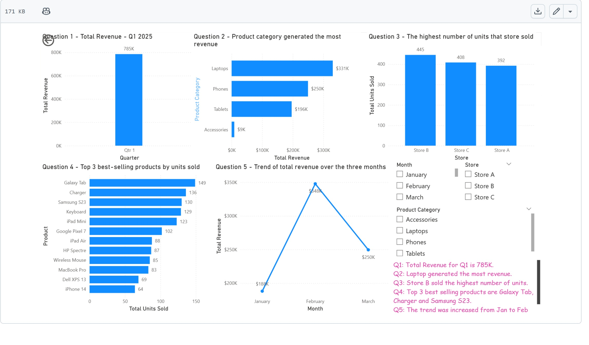

# PowerBI-Project-Retail-Store-Sales

## Retail Store Sales Analysis (Power BI)
## Project Overview

This project analyses retail sales data from an electronics store for Q1 2025. The objective was to build an interactive Power BI dashboard to monitor sales performance, identify top-performing products, and highlight key business trends.

The dashboard enables quick exploration of revenue, product performance, and store-level sales to support data-driven decision-making.

## Business Questions

The analysis focuses on answering the following key questions:

What is the total revenue for Q1 2025?

Which product category generated the most revenue?

Which store sold the highest number of units?

What are the top 3 best-selling products by units sold?

How did total revenue change across the three months?

## Dataset

The dataset contains retail sales data for an electronics store, including:

Product information

Product categories

Sales quantities

Store locations

Revenue generated

This dataset was used to evaluate sales performance across different products and stores.

## Dashboard Features

The Power BI dashboard includes several visualisations designed to answer the business questions:

KPI indicator showing total revenue

Bar charts comparing revenue by product category

Bar chart showing store sales performance

Top products visualisation highlighting best-selling items

Line chart displaying monthly revenue trends

Interactive slicers to filter and explore the data

These visuals allow users to quickly identify key sales insights and trends.

## Key Insights

Key findings from the analysis include:

Certain product categories contribute significantly more revenue than others.

A small number of products account for the majority of units sold.

Sales performance varies across store locations.

Revenue trends across the quarter provide insights into monthly sales performance.

## Business Recommendations

The analysis highlights several opportunities to improve retail performance:

• High-performing product categories could be prioritised for promotions and inventory allocation.

• Stores with lower sales performance may require targeted marketing or local promotions.

• Monitoring monthly revenue trends can help identify seasonal patterns and improve sales forecasting.

## Tools Used

Power BI

Data visualisation

Basic data modelling

Business performance analysis

## Skills Demonstrated

Power BI dashboard development

KPI and performance reporting

Data visualisation for business insights

Sales trend analysis
